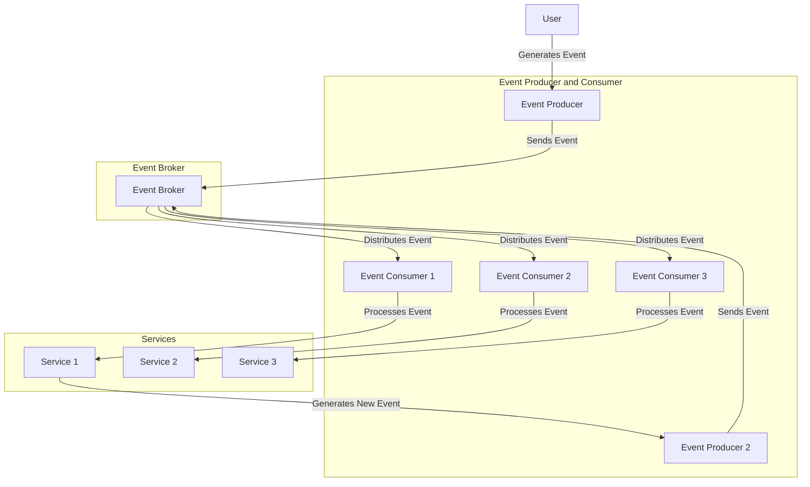
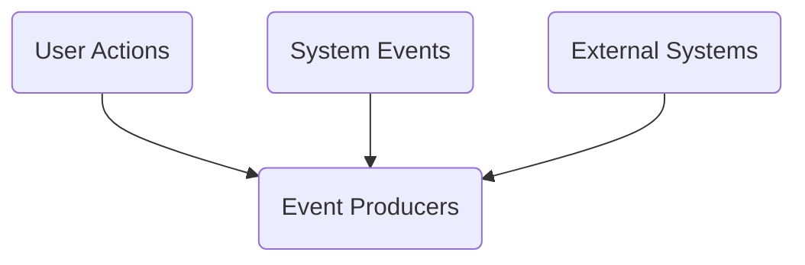
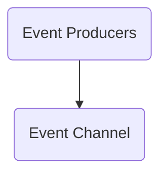
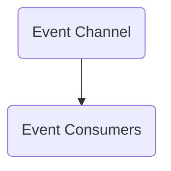
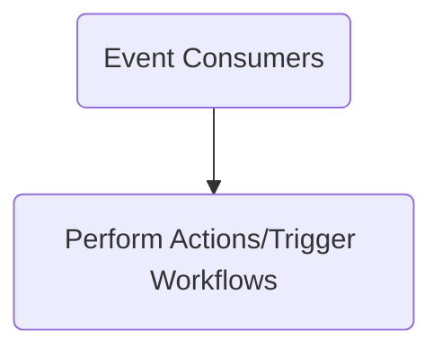
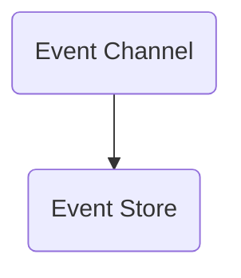
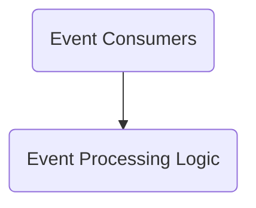
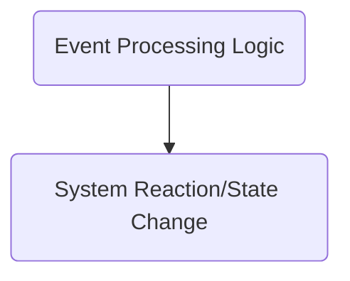
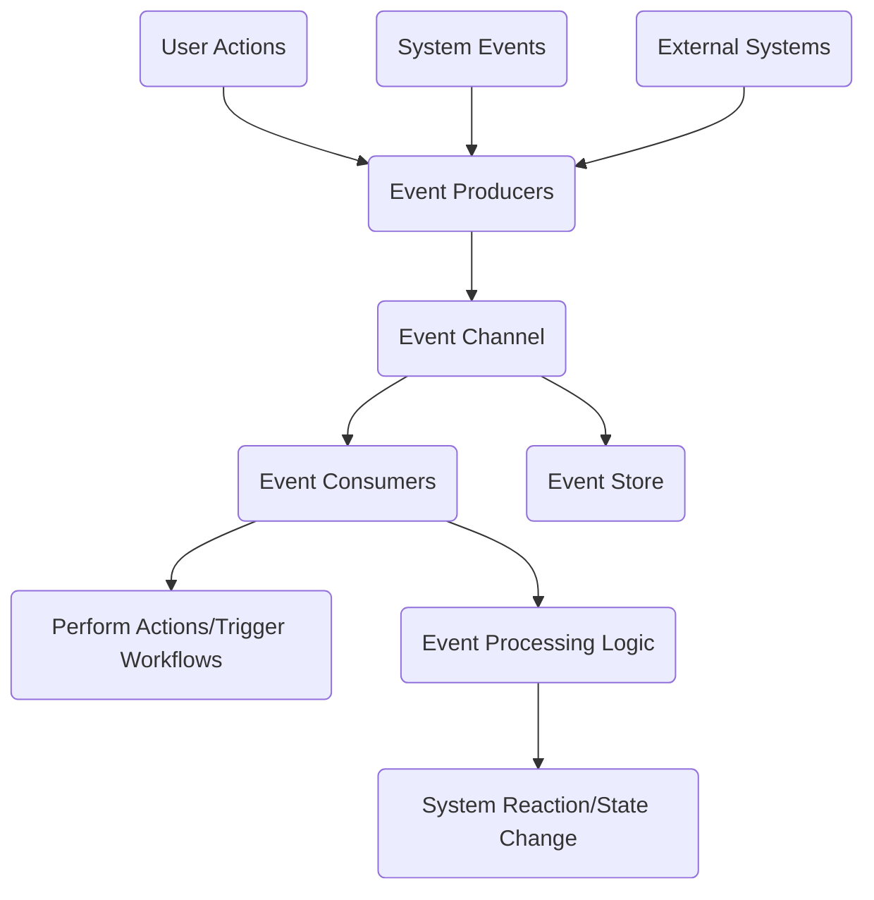

# What is Event-Driven Architecture?

## Introduction
Event-Driven Architecture (EDA) is a software architecture paradigm that promotes the production, detection, consumption, and reaction to events. An event is a significant change in state. For example, placing an order, clicking a button, or receiving a message are all events.

## Key Concepts
- **Event**: A change in state or an update, such as a user logging in, a purchase made, or a data update.
- **Event Producer**: An entity that creates and publishes events.
- **Event Consumer**: An entity that listens for events and processes them.
- **Event Channel**: A medium through which events are transmitted from producers to consumers.

## How EDA Works
1. **Event Generation**: An event producer generates an event and sends it to an event channel.
2. **Event Transmission**: The event channel transmits the event to interested consumers.
3. **Event Processing**: Event consumers process the event, often leading to the generation of new events.

### Step 1: Event Producers

### Step 2: Event Channel

### Step 3: Event Processing

### Step 4: Event Consumers

### Step 5: Event Store (Optional)

### Step 6: Event Processing Logic

### Step 7: System Reaction

### Full Diagram

## Real-World Examples
- **E-commerce Systems**: Tracking orders, inventory changes, and user actions.
- **Banking Systems**: Monitoring transactions, fraud detection, and account updates.
- **IoT Applications**: Reacting to sensor data, device updates, and environmental changes.
