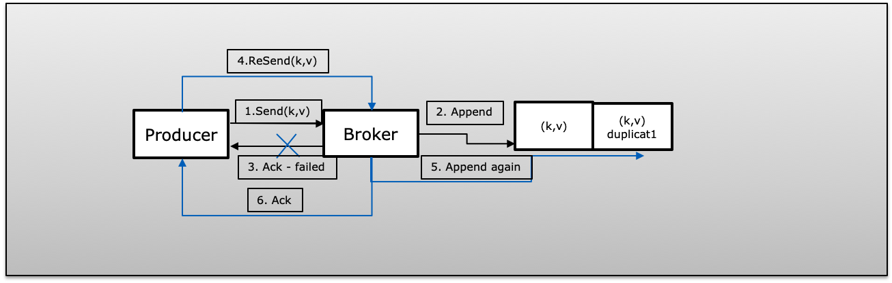
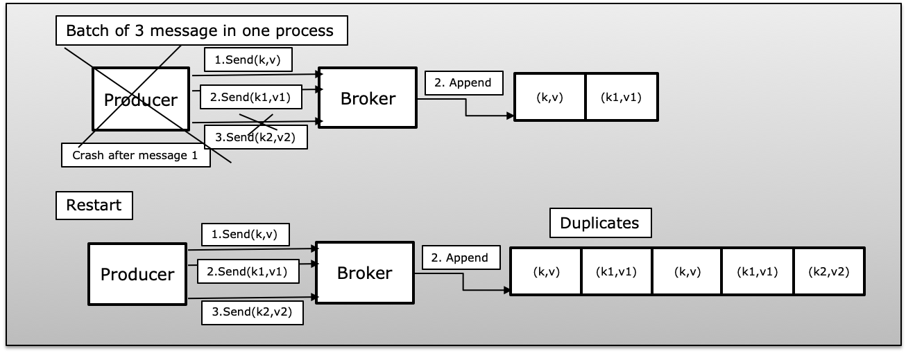
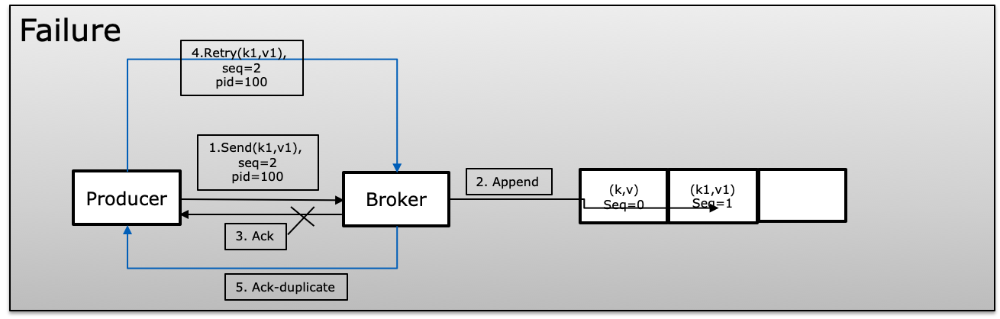
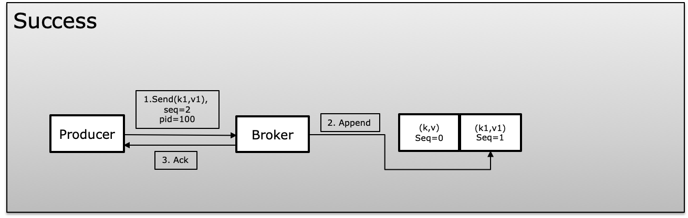

## Handling Failures and Ensuring Exactly-Once Semantics in Kafka

In a distributed environment, failures are a common occurrence. In the Kafka ecosystem, there can be various types of failures such as broker crashes, network failures, processing failures, publishing message failures, and consumption failures. These scenarios can lead to data loss and duplication.

### Failure Scenarios

#### 1. Ack Failed (Scenario A)
When a producer publishes a message successfully with `retry > 1` but fails to receive an acknowledgment due to a failure, the producer will retry the same message, potentially introducing duplicates.



#### 2. Producer Process Failed in Batch Messages (Scenario B)
If a producer sends a batch of messages and fails after some messages are published successfully, upon restarting, the producer will republish all messages from the batch, causing duplicates in Kafka.



#### 3. Fire & Forget Failed (Scenario C)
If a producer publishes a message with `retry = 0` (fire and forget) and a failure occurs, the producer will be unaware of the failure and send the next message, resulting in message loss.


#### 4. Consumer Failed in Batch Messages (Scenario D)
A consumer that receives a batch of messages from Kafka and manually commits their offset (`enable.auto.commit = false`) may fail before committing to Kafka. In this case, the next time the consumer starts, it will consume the same records again, causing duplicates on the consumer side.


### Exactly-Once Semantics

Exactly-once semantics in Kafka ensure that even if a producer retries sending a message, it will be published and consumed exactly once. To achieve this, Kafka uses the following properties:

1. `enable.idempotence = true`
2. `max.in.flight.requests.per.connection = 5` (Producer will always have one in-flight request per connection)
3. `isolation.level = read_committed`

#### Idempotent Delivery

Idempotent delivery allows the producer to write a message to Kafka exactly once to a particular partition during the lifetime of a single producer without data loss and ensuring order per partition. Kafka uses a unique ID called the producer ID (PID) and sequence numbers while producing messages. The broker compares the current sequence number with the previous one and rejects the message if the new one is not exactly +1 greater than the previous one, thus avoiding duplication.

**Configuration for Idempotent Producer:**
```java
props.put("enable.idempotence", "true");
props.put("max.in.flight.requests.per.connection", "5");
props.put("acks", "all");
props.put("retries", Integer.MAX_VALUE);
```





#### Transactions (isolation.level)

Transactions allow atomic updates to data in multiple topic partitions. All records included in a transaction will be successfully saved, or none of them will be. This also allows committing consumer offsets in the same transaction along with the data processed.

**Producer Transactions:**
```java
producer.initTransactions();
try {
    producer.beginTransaction();
    producer.send(record);
    producer.commitTransaction();
} catch (ProducerFencedException | OutOfOrderSequenceException | AuthorizationException e) {
    producer.close();
} catch (KafkaException e) {
    producer.abortTransaction();
}
```

**Consumer Configuration:**
```java
props.put("isolation.level", "read_committed");
```

#### Exactly-Once in Kafka Streams

Kafka Streams ensure exactly-once semantics in a read-process-write pattern, treating this operation as an atomic transaction. Kafka Streams use a special parameter `processing.guarantee` which can be set to `exactly_once` or `at_least_once`.

**Configuration for Exactly-Once in Kafka Streams:**
```java
props.put(StreamsConfig.PROCESSING_GUARANTEE_CONFIG, StreamsConfig.EXACTLY_ONCE);
```
