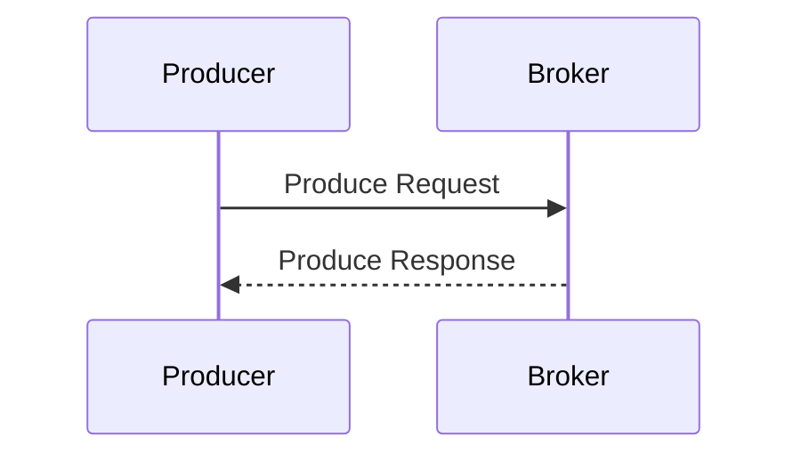
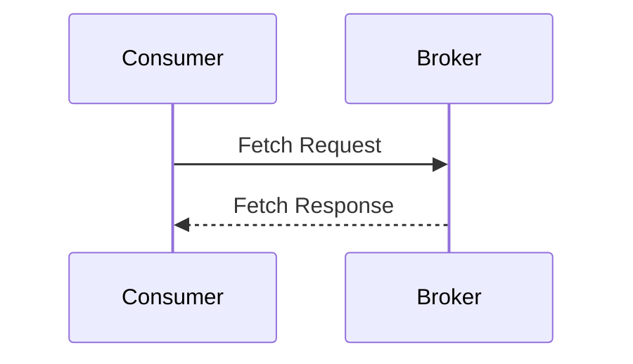
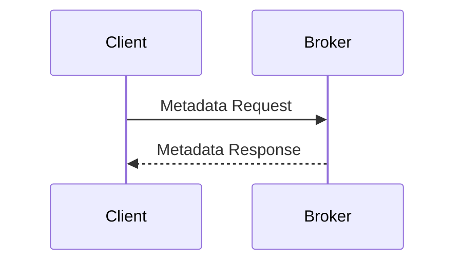
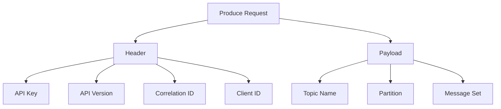
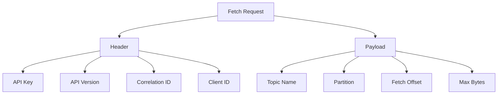
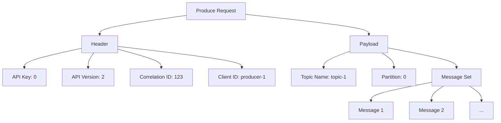
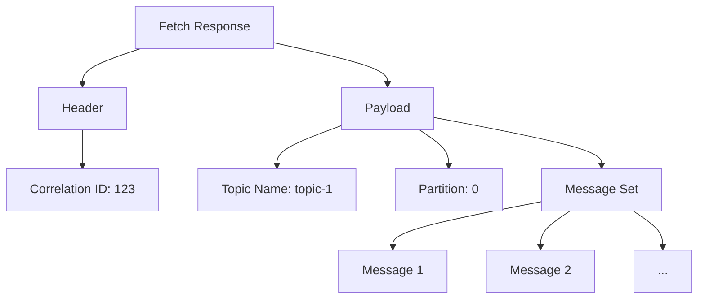
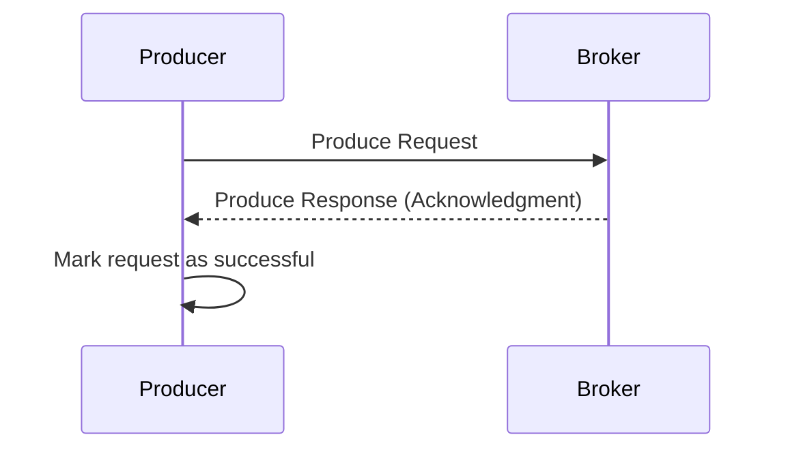
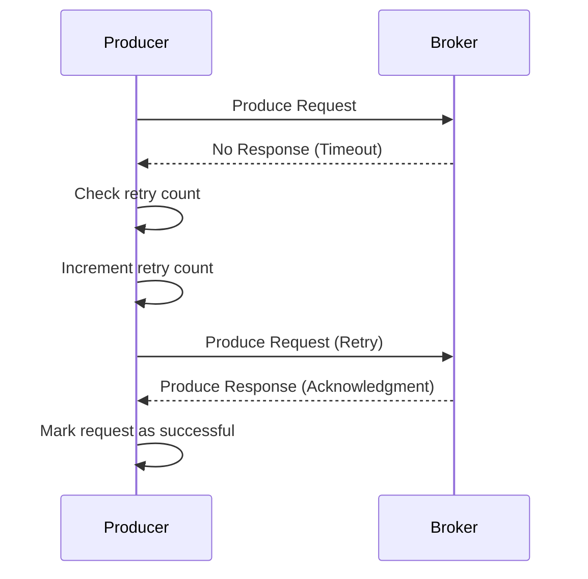

# What is Apache Kafka?

Apache Kafka is an open-source distributed event streaming platform used for building real-time data pipelines and streaming applications. It is designed to handle high-throughput, low-latency data stream processing. Kafka enables the publication, subscription, storage, and processing of data streams in a fault-tolerant and scalable manner.

### History and Background

- **Origin:** Apache Kafka was initially developed at LinkedIn by Jay Kreps, Neha Narkhede, and Jun Rao. It was open-sourced in early 2011 and became an Apache Incubator project in 2011.
- **Evolution:** Kafka was designed to address the inefficiencies of existing messaging systems and log aggregation solutions at LinkedIn. It has since evolved into a robust platform for managing real-time data streams.
- **Apache Project:** Kafka graduated from the Apache Incubator to become a top-level Apache project in October 2012.

### Key Features

1. **High Throughput:** Kafka can handle large volumes of data with very low latency, making it suitable for high-throughput use cases.
2. **Scalability:** Kafka is designed to scale horizontally. You can add more brokers to a Kafka cluster to increase its capacity.
3. **Durability:** Kafka persists messages on disk and allows for data replication across multiple nodes to ensure fault tolerance and durability.
4. **Real-time Processing:** Kafka supports real-time data stream processing, enabling applications to process data as it arrives.
5. **Fault Tolerance:** Kafka is designed to be fault-tolerant. If a broker fails, the system continues to function with minimal impact.
6. **Exactly-once Semantics:** Kafka provides exactly-once processing guarantees, ensuring that messages are processed exactly once even in the event of failures.
7. **Multiple Consumers:** Kafka allows multiple consumers to subscribe to the same stream of data and process it independently.
8. **Support for Multiple Data Sources and Sinks:** Kafka Connect provides a framework for connecting Kafka with external systems, making it easy to integrate various data sources and sinks.

### Tools in the Same Category

1. **Apache Pulsar:**
   - **Description:** An open-source distributed messaging and streaming platform, originally developed by Yahoo. It is known for its multi-tenancy and geo-replication features.
   - **Features:** Multi-tenancy, geo-replication, scalability, durability, support for multiple storage tiers.

2. **RabbitMQ:**
   - **Description:** A message broker that implements the Advanced Message Queuing Protocol (AMQP). It is widely used for building messaging applications.
   - **Features:** Reliable messaging, multiple messaging patterns, clustering, high availability, flexible routing, support for multiple protocols.

3. **Amazon Kinesis:**
   - **Description:** A fully managed service for real-time data streaming and processing offered by AWS.
   - **Features:** Real-time data ingestion and processing, scalability, integration with other AWS services, built-in data analytics capabilities.

4. **Apache ActiveMQ:**
   - **Description:** An open-source message broker that supports various messaging protocols including AMQP, MQTT, and STOMP.
   - **Features:** Clustering, message persistence, high availability, support for multiple messaging protocols, extensive client libraries.

5. **Google Cloud Pub/Sub:**
   - **Description:** A fully managed real-time messaging service that allows you to send and receive messages between independent applications.
   - **Features:** Scalability, global reach, integration with Google Cloud services, real-time analytics, at-least-once delivery.

6. **Red Hat AMQ:**
   - **Description:** A suite of messaging technologies provided by Red Hat that includes support for AMQP, MQTT, and STOMP protocols.
   - **Features:** High availability, clustering, scalability, flexible deployment options, integration with other Red Hat middleware.


   ------------------
## Comparison with Redhat AMQ (A Quick overview)

| **Feature**                      | **Apache Kafka**                                                 | **Red Hat AMQ**                                                |
|----------------------------------|------------------------------------------------------------------|----------------------------------------------------------------|
| **Messaging Model**              | Pub/Sub, message queues                                          | Pub/Sub, message queues, point-to-point                        |
| **Message Persistence**          | Disk-based, configurable retention                               | Disk-based, configurable retention                             |
| **Throughput**                   | High throughput, optimized for large-scale data streams          | Moderate to high throughput                                    |
| **Latency**                      | Low latency                                                      | Low latency                                                    |
| **Fault Tolerance**              | Data replication across multiple nodes                           | High availability clusters, replication                        |
| **Scalability**                  | Horizontal scaling by adding more brokers                        | Horizontal scaling, clustering                                  |
| **Protocol Support**             | Native Kafka protocol                                            | AMQP, MQTT, STOMP, OpenWire                                    |
| **Message Ordering**             | Guaranteed within partitions                                     | Guaranteed                                                     |
| **Transactions**                 | Supported                                                        | Supported                                                      |
| **API and Client Libraries**     | Java, Scala, Python, Go, .NET, C++, and more                     | Java, JMS, and others                                          |
| **Security**                     | SSL/TLS, SASL, Kerberos                                          | SSL/TLS, SASL, Kerberos                                        |
| **Management and Monitoring**    | Kafka Manager, Confluent Control Center, Prometheus integration  | Red Hat AMQ Console, JMX, Hawtio                               |
| **Deployment Options**           | On-premises, cloud, Kubernetes                                   | On-premises, cloud, Kubernetes, OpenShift                      |
| **Community and Support**        | Large open-source community, commercial support via Confluent    | Red Hat subscription support, enterprise focus                 |
| **License**                      | Apache License 2.0                                               | Red Hat Subscription (based on Apache ActiveMQ and Artemis)    |

------------------------------------

## Communication Protocols in Messaging Systems.

Distributed messaging systems can utilize various protocols to handle communication between clients and servers. These protocols ensure efficient, reliable, and scalable data transmission. Here are some commonly used protocols in such solutions:

### 1. **Kafka Protocol (Binary Protocol)**
- **Description**: A proprietary binary protocol developed by Apache Kafka for communication between Kafka clients and Kafka brokers.
- **Use Cases**: High-throughput, low-latency messaging and streaming data.

### 2. **HTTP/HTTPS**
- **Description**: HyperText Transfer Protocol and its secure version are used for communication over the web.
- **Use Cases**: REST APIs for administrative tasks, web-based clients, and integration with web services.
- **Examples**: Confluent REST Proxy for Kafka.

### 3. **gRPC**
- **Description**: A high-performance, open-source universal RPC framework originally developed by Google.
- **Use Cases**: Efficient, low-latency communication in microservices architectures.
- **Examples**: Implementation in some Kafka-compatible systems for service-to-service communication.

### 4. **MQTT**
- **Description**: A lightweight messaging protocol for small sensors and mobile devices optimized for high-latency or unreliable networks.
- **Use Cases**: IoT (Internet of Things) applications, real-time data collection from devices.
- **Examples**: Kafka Connect MQTT Source Connector.

### 5. **AMQP**
- **Description**: Advanced Message Queuing Protocol is an open standard application layer protocol for message-oriented middleware.
- **Use Cases**: Interoperability between different messaging systems, enterprise messaging.
- **Examples**: RabbitMQ (often compared to Kafka but can be integrated with Kafka).

### 6. **JMS (Java Message Service)**
- **Description**: A Java API that allows applications to create, send, receive, and read messages.
- **Use Cases**: Java-based enterprise applications requiring reliable messaging.
- **Examples**: Integration via Kafka Connect JMS Source Connector.

### 7. **WebSockets**
- **Description**: A protocol providing full-duplex communication channels over a single TCP connection.
- **Use Cases**: Real-time web applications, live data feeds, notifications.
- **Examples**: WebSocket API implementations for Kafka.

### 8. **STOMP**
- **Description**: Simple (or Streaming) Text Oriented Messaging Protocol is a simple text-based protocol for messaging.
- **Use Cases**: Simplicity and ease of use for scripting and text-based messaging.
- **Examples**: STOMP clients and brokers can be integrated with Kafka using bridges.

### 9. **Apache Thrift**
- **Description**: A software framework for scalable cross-language services development.
- **Use Cases**: Efficient serialization and deserialization in microservices.
- **Examples**: Can be used to serialize data sent to Kafka.

### 10. **ZeroMQ**
- **Description**: A high-performance asynchronous messaging library aimed at use in scalable distributed or concurrent applications.
- **Use Cases**: Lightweight, high-performance messaging between distributed components.
- **Examples**: Integrating with Kafka using custom connectors or bridges.

### 11. **Protobuf (Protocol Buffers)**
- **Description**: A language-neutral, platform-neutral extensible mechanism for serializing structured data.
- **Use Cases**: Efficient data serialization for high-performance applications.
- **Examples**: Commonly used with Kafka for efficient data transport.

### 12. **Avro**
- **Description**: A data serialization framework developed within Apache Hadoop's project.
- **Use Cases**: Data serialization, schema evolution, and integration with Kafka for storing and transmitting structured data.
- **Examples**: Widely used in Kafka ecosystem for data serialization.

### 13. **Kafka Connect Protocol**
- **Description**: A protocol used by Kafka Connect to transfer data between Kafka and other data systems.
- **Use Cases**: Integrating Kafka with databases, key-value stores, search indexes, and other systems.
- **Examples**: Kafka Connect JDBC, Kafka Connect Elasticsearch.

### 14. **SASL (Simple Authentication and Security Layer)**
- **Description**: A framework for authentication and data security in internet protocols.
- **Use Cases**: Enhancing security for Kafka with mechanisms like PLAIN, SCRAM, GSSAPI (Kerberos), etc.
- **Examples**: SASL configurations for secure Kafka communication.

### 15. **SSL/TLS (Secure Sockets Layer / Transport Layer Security)**
- **Description**: Protocols for securing communication over a computer network.
- **Use Cases**: Securing Kafka broker-client communication, encryption in transit.
- **Examples**: Configuring Kafka to use SSL/TLS for encrypting data.

Each protocol has its specific use cases, benefits, and limitations, making them suitable for different scenarios in messaging systems.

-------------------

## Native Protocols of Apache Kafka
Apache Kafka primarily uses its own native protocol, often referred to as the Kafka protocol, for communication between clients and brokers. Here are the details about the native protocols and extensions supported by Kafka:

### 1. **Kafka Protocol (Binary Protocol)**
- **Description**: Kafka’s native protocol is a high-performance, binary protocol developed specifically for Kafka. It facilitates communication between Kafka clients (producers, consumers) and Kafka brokers.
- **Features**:
  - **High Throughput**: Designed for high throughput, low latency, and efficient data transfer.
  - **Scalability**: Supports partitioning of topics and horizontal scaling.
  - **Fault Tolerance**: Ensures reliable message delivery with replication and acknowledgments.
  - **Operations**: Supports a variety of operations such as producing messages, consuming messages, managing offsets, topic management, group coordination, and metadata retrieval.
- **Use Cases**: Primary protocol for all Kafka client communications.

### 2. **SASL (Simple Authentication and Security Layer)**
- **Description**: SASL is a framework for authentication and data security in internet protocols. Kafka supports multiple SASL mechanisms to provide secure authentication for clients.
- **Supported Mechanisms**:
  - **SASL/PLAIN**: Simple username and password authentication.
  - **SASL/SCRAM**: Salted Challenge Response Authentication Mechanism, supporting SCRAM-SHA-256 and SCRAM-SHA-512, offering stronger security than PLAIN.
  - **SASL/GSSAPI (Kerberos)**: Used for secure authentication in enterprise environments.
  - **SASL/OAUTHBEARER**: OAuth 2.0 token-based authentication.
- **Use Cases**: Enhancing security and providing authentication for Kafka clients.

### 3. **SSL/TLS (Secure Sockets Layer / Transport Layer Security)**
- **Description**: SSL/TLS protocols provide encryption and secure communication over a computer network. Kafka supports SSL/TLS to encrypt data in transit between clients and brokers.
- **Features**:
  - **Encryption**: Ensures data privacy and integrity during transmission.
  - **Mutual Authentication**: Both client and server can authenticate each other.
  - **Certificates**: Uses digital certificates for authentication.
- **Use Cases**: Secure communication to prevent eavesdropping and tampering.

### 4. **Kafka Connect Protocol**
- **Description**: A protocol used by Kafka Connect, which is a framework for integrating Kafka with external systems such as databases, key-value stores, search indexes, and file systems.
- **Features**:
  - **Data Integration**: Facilitates data transfer between Kafka and other systems using connectors.
  - **Source and Sink Connectors**: Source connectors pull data from external systems into Kafka, and sink connectors push data from Kafka to external systems.
  - **Configuration and Management**: Simplifies configuration and management of data pipelines.
- **Use Cases**: Building data pipelines and integrating Kafka with external data sources and sinks.

### Security and Configuration
Kafka’s native protocols can be configured to enhance security and optimize performance:
- **Authentication**: SASL mechanisms provide various levels of authentication security. Kerberos and OAuth 2.0 offer robust security for enterprise environments.
- **Authorization**: Kafka supports access control lists (ACLs) to manage permissions for producing and consuming messages, topic creation, and other operations.
- **Encryption**: SSL/TLS ensures that data transmitted over the network is encrypted, providing confidentiality and integrity.
- **Compression**: Kafka supports various compression codecs like gzip, Snappy, LZ4, and Zstandard to reduce message size and improve throughput.

-------------------------------

## Kafka Protocol Overview

The Kafka protocol is a high-performance, binary protocol designed for communication between Kafka clients (producers, consumers) and Kafka brokers. It supports a variety of operations such as producing and consuming messages, managing offsets, and fetching metadata.

### Main Components

1. **Producer**: Sends messages to Kafka topics.
2. **Consumer**: Reads messages from Kafka topics.
3. **Broker**: Kafka server that stores and serves messages.
4. **Topics**: Logical channels to which messages are sent.
5. **Partitions**: Sub-divisions of topics to distribute load.

### Protocol Operations

1. **Produce**: Send messages to a topic.
2. **Fetch**: Retrieve messages from a topic.
3. **Metadata**: Get metadata about topics, partitions, and brokers.
4. **Offset Commit/Fetch**: Manage consumer offsets.

### Communication Flow

#### 1. Produce Request Flow



#### 2. Fetch Request Flow



#### 3. Metadata Request Flow



### Request and Response Structure

Each request and response in the Kafka protocol consists of a fixed header followed by a variable-length payload.

#### Produce Request



#### Fetch Request



### Example Produce Request Structure



### Example Fetch Response Structure



### Communication Sequence

1. **Producer sends a Produce Request** to the broker with messages for a specific topic and partition.
2. **Broker processes the Produce Request** and stores the messages in the respective partition.
3. **Broker sends a Produce Response** back to the producer indicating success or failure.
4. **Consumer sends a Fetch Request** to the broker specifying the topic, partition, and offset.
5. **Broker processes the Fetch Request** and retrieves the messages from the specified offset.
6. **Broker sends a Fetch Response** back to the consumer with the requested messages.


---------------------------------

>[!NOTE]
>If a producer does not receive a response from the broker after sending data, its behavior depends on the configuration settings and the specific implementation of the Kafka producer. 

### 1. Retries and Acknowledgments

Kafka producers have configurations to handle retries and acknowledgments which influence the behavior when a response is not received:

- **acks**: Determines the number of acknowledgments the producer requires the leader to have received before considering a request complete. Common settings include:
  - `acks=0`: No acknowledgment is required from the broker (fire-and-forget).
  - `acks=1`: The leader broker must write the record to its local log but does not wait for all followers to replicate the record.
  - `acks=all` (or `acks=-1`): The leader waits for the full set of in-sync replicas to acknowledge the record.

- **retries**: Specifies the number of times the producer will attempt to send the data again if an acknowledgment is not received. The default value is typically set to `2147483647` (maximum integer), meaning it will retry indefinitely.

- **retry.backoff.ms**: The amount of time to wait before attempting to retry a failed request to a given topic partition.

### 2. Timeouts and Error Handling

- **request.timeout.ms**: The configuration controls the maximum amount of time the producer will wait for a broker to acknowledge a request. If the timeout is reached without a response, the producer will consider the request as failed and will retry based on the `retries` setting.

- **max.in.flight.requests.per.connection**: Limits the number of unacknowledged requests the client will send on a single connection before blocking. If set to 1, it ensures that messages are sent in order, but setting it to a higher value can improve throughput at the cost of potentially out-of-order delivery in case of retries.

### 3. Scenario and Flow

#### Normal Flow with Response


#### No Response from Broker (Retries Enabled)


### Example Configuration
Here's an example of how you might configure a Kafka producer to handle retries and acknowledgments:

```java
Properties props = new Properties();
props.put("bootstrap.servers", "broker1:9092,broker2:9092");
props.put("acks", "all"); // Wait for all in-sync replicas to acknowledge
props.put("retries", 3); // Retry up to 3 times
props.put("retry.backoff.ms", 100); // 100 ms backoff between retries
props.put("request.timeout.ms", 30000); // 30 seconds timeout
props.put("max.in.flight.requests.per.connection", 5); // Allow up to 5 unacknowledged requests
props.put("key.serializer", "org.apache.kafka.common.serialization.StringSerializer");
props.put("value.serializer", "org.apache.kafka.common.serialization.StringSerializer");

KafkaProducer<String, String> producer = new KafkaProducer<>(props);
```

### Key Points

1. **Retry Mechanism**: The producer will retry sending the message if it does not receive an acknowledgment from the broker, based on the `retries` setting.
2. **Timeout Handling**: The producer will wait for the duration specified in `request.timeout.ms` before considering the request as failed and retrying.
3. **Data Consistency**: With `acks=all`, the producer ensures higher consistency by waiting for all in-sync replicas to acknowledge the message, reducing the likelihood of data loss.


