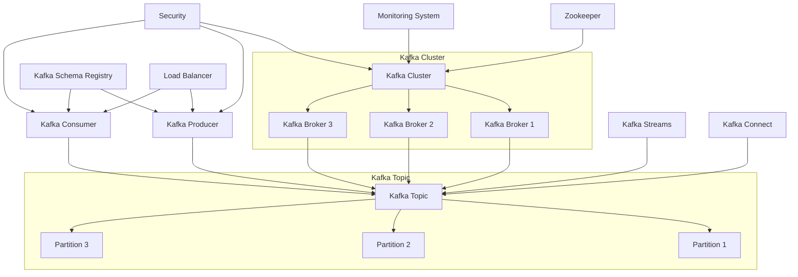

# Core Components of Kafka: Producers, Consumers, Brokers, Topics

## Glossary 
1. **Kafka Cluster**
   - **Description:** A collection of Kafka brokers working together to manage and distribute data.
   - **Function:** Ensures data availability and scalability by distributing data across multiple brokers.

2. **Kafka Broker**
   - **Description:** A server in a Kafka cluster that stores and manages data.
   - **Function:** Handles incoming data from producers, stores it, and serves it to consumers.

3. **Kafka Topic**
   - **Description:** A category or feed name to which records are published.
   - **Function:** Organizes and groups data streams, allowing producers to send data to specific topics and consumers to read from them.

4. **Kafka Partition**
   - **Description:** A division of a topic into multiple segments.
   - **Function:** Allows data within a topic to be distributed across multiple brokers, enabling parallel processing and scalability.

5. **Kafka Producer**
   - **Description:** A client application that sends records to a Kafka topic.
   - **Function:** Generates and sends data to Kafka topics, ensuring data is available for consumers.

6. **Kafka Consumer**
   - **Description:** A client application that reads records from Kafka topics.
   - **Function:** Retrieves and processes data from Kafka topics, enabling downstream applications to use the data.

7. **Kafka Streams**
   - **Description:** A library for building real-time streaming applications on top of Kafka.
   - **Function:** Provides tools for processing and transforming data streams within Kafka, enabling real-time analytics and complex event processing.

8. **Kafka Connect**
   - **Description:** A framework for connecting Kafka with external systems.
   - **Function:** Simplifies integration by providing connectors that move large data sets into and out of Kafka.

9. **Kafka Zookeeper**
   - **Description:** A centralized service for maintaining configuration information and distributed synchronization.
   - **Function:** Manages Kafka brokers, tracks cluster state, and handles leader election for partitions.

10. **Kafka Log**
    - **Description:** A structured, append-only data structure used by Kafka brokers to store records.
    - **Function:** Ensures durability and sequential data storage for efficient read and write operations.

11. **Kafka Offset**
    - **Description:** A unique identifier for each record within a partition.
    - **Function:** Tracks the position of records within a partition, enabling consumers to read data sequentially and maintain progress.

12. **Kafka Consumer Group**
    - **Description:** A group of consumers that coordinate to consume data from a topic.
    - **Function:** Distributes the load of data consumption across multiple consumers, providing parallel processing and fault tolerance.

13. **Kafka Record**
    - **Description:** A key-value pair that is the basic unit of data sent to and read from Kafka.
    - **Function:** Encapsulates data being produced and consumed in Kafka, ensuring a standard format for communication.

14. **Kafka Schema Registry**
    - **Description:** A service for managing and validating schemas for Kafka records.
    - **Function:** Ensures data compatibility and structure consistency by storing and enforcing schemas.

15. **Kafka Serialization**
    - **Description:** The process of converting objects into byte arrays for transmission.
    - **Function:** Prepares data for transport over Kafka by converting it to a byte format.

16. **Kafka Deserialization**
    - **Description:** The process of converting byte arrays back into objects.
    - **Function:** Reconstructs original data objects from byte arrays received from Kafka.

17. **Kafka Configuration**
    - **Description:** Settings that define the behavior of Kafka clients and brokers.
    - **Function:** Customizes Kafka's performance, reliability, and resource usage based on specific requirements.

18. **Kafka Acks**
    - **Description:** Acknowledgment settings that control the reliability of message delivery.
    - **Function:** Determines the level of guarantee for message delivery, affecting durability and performance.

19. **Kafka Replication**
    - **Description:** The process of copying data across multiple brokers.
    - **Function:** Ensures high availability and fault tolerance by maintaining multiple copies of data.

20. **Kafka Batch Size**
    - **Description:** The size of batches for records sent by producers.
    - **Function:** Controls how many records are sent in one batch, impacting throughput and latency.

21. **Kafka Linger.ms**
    - **Description:** The time a producer waits before sending a batch.
    - **Function:** Allows more records to accumulate before sending, improving batching efficiency.

22. **Kafka Compression**
    - **Description:** Techniques for compressing data before sending it to Kafka.
    - **Function:** Reduces the size of data sent, saving bandwidth and storage.

23. **Kafka Throughput**
    - **Description:** The rate at which data is processed by Kafka.
    - **Function:** Measures Kafka's performance in terms of data handling capacity.

24. **Kafka Latency**
    - **Description:** The time taken for data to travel from producer to consumer.
    - **Function:** Indicates the responsiveness of the Kafka system, affecting real-time processing.

25. **Kafka Monitoring**
    - **Description:** Tools and techniques for observing Kafka's performance and health.
    - **Function:** Ensures the Kafka system is running optimally and helps identify issues.

26. **Kafka Metrics**
    - **Description:** Quantitative measures of Kafka's performance.
    - **Function:** Provides insights into various aspects of Kafka operations, such as message rates and error counts.

27. **Kafka MirrorMaker**
    - **Description:** A tool for replicating data between Kafka clusters.
    - **Function:** Facilitates data migration, backup, and disaster recovery.

28. **Kafka Connectors**
    - **Description:** Pre-built plugins for integrating Kafka with other systems.
    - **Function:** Simplifies the process of moving data into and out of Kafka without custom code.

29. **Kafka Rest Proxy**
    - **Description:** A RESTful interface for interacting with Kafka.
    - **Function:** Allows applications to produce and consume messages using HTTP, simplifying integration.

30. **Kafka Security**
    - **Description:** Mechanisms for securing Kafka communications and data.
    - **Function:** Protects data in transit and ensures only authorized access.

31. **Kafka ACLs**
    - **Description:** Access Control Lists for Kafka resources.
    - **Function:** Manages permissions and controls who can access and perform actions on Kafka topics and clusters.

32. **Kafka SSL**
    - **Description:** Secure Sockets Layer for encrypting Kafka communications.
    - **Function:** Ensures secure data transmission between Kafka clients and brokers.

33. **Kafka Kerberos**
    - **Description:** An authentication protocol used by Kafka for securing access.
    - **Function:** Provides strong authentication for Kafka clients and brokers.

34. **Kafka Idempotence**
    - **Description:** A feature ensuring that message production is exactly-once.
    - **Function:** Prevents duplicate message delivery, enhancing data reliability.

35. **Kafka Exactly-once**
    - **Description:** Guarantee that each message is delivered exactly once.
    - **Function:** Ensures data consistency and reliability in processing streams.

36. **Kafka Transactions**
    - **Description:** A mechanism for ensuring atomic operations in Kafka.
    - **Function:** Allows producers and consumers to work within transactions, ensuring all-or-nothing processing.

37. **Kafka Leader**
    - **Description:** The broker responsible for a partition's read and write operations.
    - **Function:** Manages and coordinates data for its partitions, ensuring consistency.

38. **Kafka Follower**
    - **Description:** A broker that replicates data from the leader.
    - **Function:** Provides redundancy and takes over if the leader fails.

39. **Kafka ISR (In-Sync Replica)**
    - **Description:** A replica that is fully caught up with the leader.
    - **Function:** Ensures data redundancy and helps maintain consistency.

40. **Kafka Controller**
    - **Description:** The broker responsible for managing cluster metadata.
    - **Function:** Oversees the state of the Kafka cluster and handles administrative tasks like leader election.

41. **Kafka Retention**
    - **Description:** Policies for how long Kafka retains records.
    - **Function:** Controls data lifecycle, ensuring that old data is deleted or archived.

42. **Kafka Compaction**
    - **Description:** A cleanup process that removes obsolete records.
    - **Function:** Ensures storage efficiency by keeping only the latest version of each record.

43. **Kafka Quotas**
    - **Description:** Limits on resource usage for Kafka clients.
    - **Function:** Prevents any single client from overwhelming the Kafka cluster, ensuring fair resource distribution.

44. **Kafka Throttling**
    - **Description:** Controlling the rate of requests to Kafka.
    - **Function:** Protects the cluster from excessive load and ensures stability.

45. **Kafka Rebalancing**
    - **Description:** The process of redistributing partitions among consumers in a group.
    - **Function:** Ensures balanced workload distribution and efficient resource utilization.

46. **Kafka Consumer Lag**
    - **Description:** The delay between the latest record and the records consumed.
    - **Function:** Indicates how far behind the consumer is, helping to monitor performance.

47. **Kafka Avro**
    - **Description:** A serialization framework used with Kafka.
    - **Function:** Provides a compact, fast, binary data format and supports schema evolution.

48. **Kafka JSON**
    - **Description:** A text-based data format used with Kafka.
    - **Function:** Allows easy integration with web technologies and readable data interchange.

49. **Kafka Protobuf**
    - **Description:** A language-neutral, platform-neutral extensible mechanism for serializing structured data.
    - **Function:** Provides efficient and structured data serialization with schema support.

50. **

Kafka Message Queue**
    - **Description:** A system for sending and receiving messages.
    - **Function:** Acts as a buffer for messages in transit, enabling decoupled and asynchronous communication between systems.

-------------------------

# Key components of Apache Kafka:

### Description of Key Components:
1. **Zookeeper**: A centralized service for maintaining configuration information, naming, providing distributed synchronization, and providing group services.
2. **Kafka Cluster**: Comprises multiple Kafka brokers working together to form a distributed system.
3. **Kafka Broker**: A server that stores and manages data, part of the Kafka cluster.
4. **Kafka Topic**: A logical channel to which producers send data and from which consumers read data.
5. **Partition**: A segment of a topic that allows for parallel processing of data.
6. **Kafka Producer**: A client application that sends records to a Kafka topic.
7. **Kafka Consumer**: A client application that reads records from a Kafka topic.
8. **Kafka Streams**: A client library for building applications and microservices, where the input and output data are stored in Kafka clusters.
9. **Kafka Connect**: A tool for scalably and reliably streaming data between Apache Kafka and other data systems.
10. **Kafka Schema Registry**: A service that provides a repository for schemas and a serving layer for your metadata.
11. **Monitoring System**: Tools and systems used to monitor the health and performance of the Kafka cluster.
12. **Load Balancer**: Distributes incoming requests to the Kafka producers and consumers to balance the load.
13. **Security**: Ensures that data in Kafka is secure and only accessible to authorized users and clients.