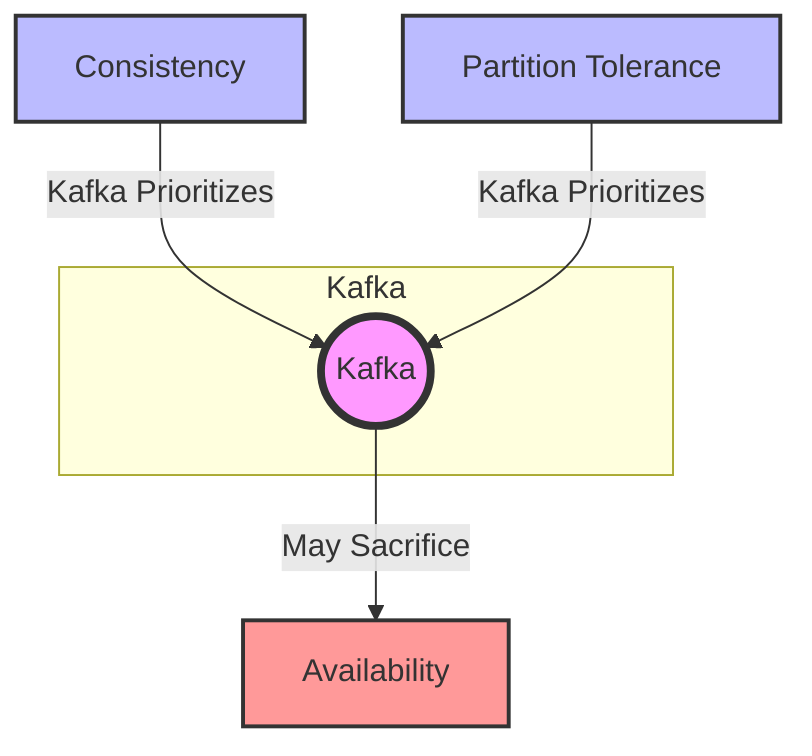

# Kafka Ecosystem and Common Use Cases

Apache Kafka, like many distributed systems, is often analyzed through the lens of the CAP theorem, which states that a distributed data store can simultaneously provide only two out of the following three guarantees:

1. **Consistency (C)**: Every read receives the most recent write or an error.
2. **Availability (A)**: Every request receives a response, without guarantee that it contains the most recent write.
3. **Partition Tolerance (P)**: The system continues to operate despite an arbitrary number of messages being dropped (or delayed) by the network between nodes.

Kafka is designed to be partition tolerant and to provide strong consistency, sacrificing some aspects of availability under certain failure conditions. In practice, Kafka can be configured to balance these trade-offs based on the requirements of the use case.

### CAP Theorem Analysis for Kafka

- **Partition Tolerance (P)**: Kafka is inherently partition tolerant. It is designed to continue functioning even if there are network partitions.
- **Consistency (C)**: Kafka ensures strong consistency by replicating data across multiple nodes and ensuring that a majority of replicas acknowledge a write before it is considered committed.
- **Availability (A)**: Kafka can sacrifice availability in certain failure scenarios. For example, if a majority of replicas are not available, Kafka will not allow reads and writes to ensure consistency.

### Graphical Representation 

In this diagram:
- Kafka (KP) prioritizes Partition Tolerance (P) and Consistency (C).
- Kafka may sacrifice Availability (A) in certain scenarios to ensure strong consistency and partition tolerance.

--------------------------------------------------------------

# Topics Creation  Examples

## An E-commerce Application

### 1. User Activity
- **user-signup**
  - For tracking user registration events.
- **user-login**
  - For tracking user login events.
- **user-logout**
  - For tracking user logout events.
- **user-profile-update**
  - For tracking updates to user profiles.
- **user-password-change**
  - For tracking password changes.

### 2. Product Management
- **product-add**
  - For tracking the addition of new products.
- **product-update**
  - For tracking updates to existing products.
- **product-delete**
  - For tracking the deletion of products.
- **product-view**
  - For tracking product view events.

### 3. Orders
- **order-create**
  - For tracking the creation of new orders.
- **order-update**
  - For tracking updates to existing orders (e.g., status changes).
- **order-cancel**
  - For tracking order cancellations.
- **order-fulfillment**
  - For tracking the fulfillment of orders.

### 4. Payments
- **payment-initiate**
  - For tracking the initiation of payment processes.
- **payment-complete**
  - For tracking completed payments.
- **payment-failure**
  - For tracking failed payment attempts.
- **payment-refund**
  - For tracking refunds issued.

### 5. Inventory Management
- **inventory-update**
  - For tracking changes in inventory levels.
- **inventory-check**
  - For tracking inventory checks or audits.
- **inventory-restock**
  - For tracking restocking events.

### 6. Shipping
- **shipping-create**
  - For tracking the creation of shipping orders.
- **shipping-update**
  - For tracking updates to shipping orders (e.g., status changes).
- **shipping-deliver**
  - For tracking delivery of shipments.

### 7. Customer Support
- **support-ticket-create**
  - For tracking the creation of new support tickets.
- **support-ticket-update**
  - For tracking updates to existing support tickets.
- **support-ticket-close**
  - For tracking the closure of support tickets.

### 8. Marketing and Promotions
- **promotion-create**
  - For tracking the creation of new promotions.
- **promotion-update**
  - For tracking updates to existing promotions.
- **promotion-expiry**
  - For tracking the expiration of promotions.
- **campaign-create**
  - For tracking the creation of new marketing campaigns.
- **campaign-update**
  - For tracking updates to marketing campaigns.
- **campaign-complete**
  - For tracking the completion of marketing campaigns.

### 9. Analytics and Tracking
- **page-visit**
  - For tracking visits to different pages on the website.
- **click-stream**
  - For tracking user clicks and navigation paths.
- **search-query**
  - For tracking search queries made by users.
- **ad-click**
  - For tracking clicks on advertisements.

### 10. Notifications
- **email-notification**
  - For tracking email notifications sent to users.
- **sms-notification**
  - For tracking SMS notifications sent to users.
- **push-notification**
  - For tracking push notifications sent to users.

### 11. Reviews and Ratings
- **product-review**
  - For tracking product reviews submitted by users.
- **product-rating**
  - For tracking product ratings given by users.

### 12. Recommendations
- **recommendation-view**
  - For tracking viewed recommendations.
- **recommendation-click**
  - For tracking clicks on recommendations.

----------------------

## An insurance Company

### 1. Customer Management
- **customer-signup**
  - For tracking new customer registrations.
- **customer-login**
  - For tracking customer login events.
- **customer-logout**
  - For tracking customer logout events.
- **customer-profile-update**
  - For tracking updates to customer profiles.
- **customer-password-change**
  - For tracking password changes.

### 2. Policy Management
- **policy-create**
  - For tracking the creation of new insurance policies.
- **policy-update**
  - For tracking updates to existing policies.
- **policy-renew**
  - For tracking policy renewals.
- **policy-cancel**
  - For tracking policy cancellations.
- **policy-expiry**
  - For tracking policy expirations.

### 3. Claims Management
- **claim-file**
  - For tracking the filing of new insurance claims.
- **claim-update**
  - For tracking updates to existing claims (e.g., status changes).
- **claim-approve**
  - For tracking claim approvals.
- **claim-reject**
  - For tracking claim rejections.
- **claim-payout**
  - For tracking the payout of approved claims.

### 4. Payments
- **premium-payment-initiate**
  - For tracking the initiation of premium payment processes.
- **premium-payment-complete**
  - For tracking completed premium payments.
- **premium-payment-failure**
  - For tracking failed premium payment attempts.
- **refund-initiate**
  - For tracking the initiation of refund processes.
- **refund-complete**
  - For tracking completed refunds.

### 5. Underwriting
- **underwriting-request**
  - For tracking new underwriting requests.
- **underwriting-update**
  - For tracking updates to underwriting processes.
- **underwriting-approval**
  - For tracking underwriting approvals.
- **underwriting-rejection**
  - For tracking underwriting rejections.

### 6. Customer Support
- **support-ticket-create**
  - For tracking the creation of new support tickets.
- **support-ticket-update**
  - For tracking updates to existing support tickets.
- **support-ticket-close**
  - For tracking the closure of support tickets.

### 7. Marketing and Promotions
- **promotion-create**
  - For tracking the creation of new promotions.
- **promotion-update**
  - For tracking updates to existing promotions.
- **promotion-expiry**
  - For tracking the expiration of promotions.
- **campaign-create**
  - For tracking the creation of new marketing campaigns.
- **campaign-update**
  - For tracking updates to marketing campaigns.
- **campaign-complete**
  - For tracking the completion of marketing campaigns.

### 8. Risk Assessment
- **risk-assessment-request**
  - For tracking new risk assessment requests.
- **risk-assessment-update**
  - For tracking updates to risk assessments.
- **risk-assessment-complete**
  - For tracking completed risk assessments.

### 9. Analytics and Tracking
- **page-visit**
  - For tracking visits to different pages on the website.
- **click-stream**
  - For tracking user clicks and navigation paths.
- **search-query**
  - For tracking search queries made by users.
- **ad-click**
  - For tracking clicks on advertisements.

### 10. Notifications
- **email-notification**
  - For tracking email notifications sent to customers.
- **sms-notification**
  - For tracking SMS notifications sent to customers.
- **push-notification**
  - For tracking push notifications sent to customers.

### 11. Document Management
- **document-upload**
  - For tracking the upload of documents by customers.
- **document-update**
  - For tracking updates to uploaded documents.
- **document-approval**
  - For tracking the approval of documents.
- **document-rejection**
  - For tracking the rejection of documents.

### 12. Agent Management
- **agent-signup**
  - For tracking new agent registrations.
- **agent-login**
  - For tracking agent login events.
- **agent-logout**
  - For tracking agent logout events.
- **agent-profile-update**
  - For tracking updates to agent profiles.
- **agent-performance**
  - For tracking agent performance metrics.

----------------------------------------
## A Bank 

### 1. Customer Management
- **customer-signup**
  - For tracking new customer registrations.
- **customer-login**
  - For tracking customer login events.
- **customer-logout**
  - For tracking customer logout events.
- **customer-profile-update**
  - For tracking updates to customer profiles.
- **customer-password-change**
  - For tracking password changes.

### 2. Account Management
- **account-create**
  - For tracking the creation of new bank accounts.
- **account-update**
  - For tracking updates to existing accounts.
- **account-close**
  - For tracking account closures.
- **account-freeze**
  - For tracking account freezes due to suspicious activity or other reasons.
- **account-unfreeze**
  - For tracking the unfreezing of accounts.

### 3. Transactions
- **transaction-initiate**
  - For tracking the initiation of financial transactions.
- **transaction-complete**
  - For tracking completed transactions.
- **transaction-failure**
  - For tracking failed transaction attempts.
- **transaction-reversal**
  - For tracking transaction reversals.

### 4. Payments
- **payment-initiate**
  - For tracking the initiation of payment processes.
- **payment-complete**
  - For tracking completed payments.
- **payment-failure**
  - For tracking failed payment attempts.
- **payment-refund**
  - For tracking refunds issued.

### 5. Loans and Mortgages
- **loan-application**
  - For tracking new loan applications.
- **loan-approval**
  - For tracking loan approvals.
- **loan-disbursement**
  - For tracking the disbursement of loan funds.
- **loan-repayment**
  - For tracking loan repayments.
- **loan-default**
  - For tracking loan defaults.
- **mortgage-application**
  - For tracking new mortgage applications.
- **mortgage-approval**
  - For tracking mortgage approvals.
- **mortgage-disbursement**
  - For tracking the disbursement of mortgage funds.
- **mortgage-repayment**
  - For tracking mortgage repayments.
- **mortgage-default**
  - For tracking mortgage defaults.

### 6. Customer Support
- **support-ticket-create**
  - For tracking the creation of new support tickets.
- **support-ticket-update**
  - For tracking updates to existing support tickets.
- **support-ticket-close**
  - For tracking the closure of support tickets.

### 7. Marketing and Promotions
- **promotion-create**
  - For tracking the creation of new promotions.
- **promotion-update**
  - For tracking updates to existing promotions.
- **promotion-expiry**
  - For tracking the expiration of promotions.
- **campaign-create**
  - For tracking the creation of new marketing campaigns.
- **campaign-update**
  - For tracking updates to marketing campaigns.
- **campaign-complete**
  - For tracking the completion of marketing campaigns.

### 8. Risk Management
- **risk-assessment-request**
  - For tracking new risk assessment requests.
- **risk-assessment-update**
  - For tracking updates to risk assessments.
- **risk-assessment-complete**
  - For tracking completed risk assessments.

### 9. Analytics and Tracking
- **page-visit**
  - For tracking visits to different pages on the website.
- **click-stream**
  - For tracking user clicks and navigation paths.
- **search-query**
  - For tracking search queries made by users.
- **ad-click**
  - For tracking clicks on advertisements.

### 10. Notifications
- **email-notification**
  - For tracking email notifications sent to customers.
- **sms-notification**
  - For tracking SMS notifications sent to customers.
- **push-notification**
  - For tracking push notifications sent to customers.

### 11. Fraud Detection
- **fraud-detection-alert**
  - For tracking alerts generated by fraud detection systems.
- **fraud-investigation-start**
  - For tracking the start of fraud investigations.
- **fraud-investigation-update**
  - For tracking updates to ongoing fraud investigations.
- **fraud-investigation-complete**
  - For tracking the completion of fraud investigations.

### 12. Document Management
- **document-upload**
  - For tracking the upload of documents by customers.
- **document-update**
  - For tracking updates to uploaded documents.
- **document-approval**
  - For tracking the approval of documents.
- **document-rejection**
  - For tracking the rejection of documents.

### 13. Card Management
- **card-issue**
  - For tracking the issuance of new debit/credit cards.
- **card-activation**
  - For tracking the activation of issued cards.
- **card-deactivation**
  - For tracking the deactivation of cards.
- **card-replacement**
  - For tracking the replacement of lost or damaged cards.

### 14. Investments
- **investment-portfolio-create**
  - For tracking the creation of new investment portfolios.
- **investment-buy**
  - For tracking the purchase of investments.
- **investment-sell**
  - For tracking the sale of investments.
- **investment-update**
  - For tracking updates to investment portfolios.

### 15. Internal Operations
- **employee-login**
  - For tracking employee login events.
- **employee-logout**
  - For tracking employee logout events.
- **employee-activity**
  - For tracking activities performed by employees.

----------------------------------

## A Book Store that also organize events

### 1. Customer Management
- **customer-signup**
  - For tracking new customer registrations.
- **customer-login**
  - For tracking customer login events.
- **customer-logout**
  - For tracking customer logout events.
- **customer-profile-update**
  - For tracking updates to customer profiles.
- **customer-password-change**
  - For tracking password changes.

### 2. Book Inventory
- **book-add**
  - For tracking the addition of new books to the inventory.
- **book-update**
  - For tracking updates to existing books.
- **book-delete**
  - For tracking the removal of books from the inventory.
- **book-view**
  - For tracking book view events.

### 3. Orders
- **order-create**
  - For tracking the creation of new book orders.
- **order-update**
  - For tracking updates to existing orders (e.g., status changes).
- **order-cancel**
  - For tracking order cancellations.
- **order-fulfillment**
  - For tracking the fulfillment of orders.

### 4. Payments
- **payment-initiate**
  - For tracking the initiation of payment processes.
- **payment-complete**
  - For tracking completed payments.
- **payment-failure**
  - For tracking failed payment attempts.
- **payment-refund**
  - For tracking refunds issued.

### 5. Inventory Management
- **inventory-update**
  - For tracking changes in book inventory levels.
- **inventory-check**
  - For tracking inventory checks or audits.
- **inventory-restock**
  - For tracking restocking events.

### 6. Shipping
- **shipping-create**
  - For tracking the creation of shipping orders.
- **shipping-update**
  - For tracking updates to shipping orders (e.g., status changes).
- **shipping-deliver**
  - For tracking delivery of shipments.

### 7. Customer Support
- **support-ticket-create**
  - For tracking the creation of new support tickets.
- **support-ticket-update**
  - For tracking updates to existing support tickets.
- **support-ticket-close**
  - For tracking the closure of support tickets.

### 8. Marketing and Promotions
- **promotion-create**
  - For tracking the creation of new promotions.
- **promotion-update**
  - For tracking updates to existing promotions.
- **promotion-expiry**
  - For tracking the expiration of promotions.
- **campaign-create**
  - For tracking the creation of new marketing campaigns.
- **campaign-update**
  - For tracking updates to marketing campaigns.
- **campaign-complete**
  - For tracking the completion of marketing campaigns.

### 9. Events Management
- **event-create**
  - For tracking the creation of new events (e.g., book signings, readings).
- **event-update**
  - For tracking updates to existing events.
- **event-cancel**
  - For tracking the cancellation of events.
- **event-registration**
  - For tracking customer registrations for events.
- **event-attendance**
  - For tracking attendance at events.

### 10. Analytics and Tracking
- **page-visit**
  - For tracking visits to different pages on the website.
- **click-stream**
  - For tracking user clicks and navigation paths.
- **search-query**
  - For tracking search queries made by users.
- **ad-click**
  - For tracking clicks on advertisements.

### 11. Notifications
- **email-notification**
  - For tracking email notifications sent to customers.
- **sms-notification**
  - For tracking SMS notifications sent to customers.
- **push-notification**
  - For tracking push notifications sent to customers.

### 12. Reviews and Ratings
- **book-review**
  - For tracking book reviews submitted by customers.
- **book-rating**
  - For tracking book ratings given by customers.

### 13. Recommendations
- **recommendation-view**
  - For tracking viewed recommendations.
- **recommendation-click**
  - For tracking clicks on recommendations.

### 14. Memberships
- **membership-create**
  - For tracking the creation of new membership accounts.
- **membership-update**
  - For tracking updates to membership accounts.
- **membership-renew**
  - For tracking membership renewals.
- **membership-cancel**
  - For tracking membership cancellations.

### 15. Author Management
- **author-signup**
  - For tracking new author signups.
- **author-profile-update**
  - For tracking updates to author profiles.
- **author-event-create**
  - For tracking the creation of events by authors.

### 16. Internal Operations
- **employee-login**
  - For tracking employee login events.
- **employee-logout**
  - For tracking employee logout events.
- **employee-activity**
  - For tracking activities performed by employees.

------------------------------------------------------------------

