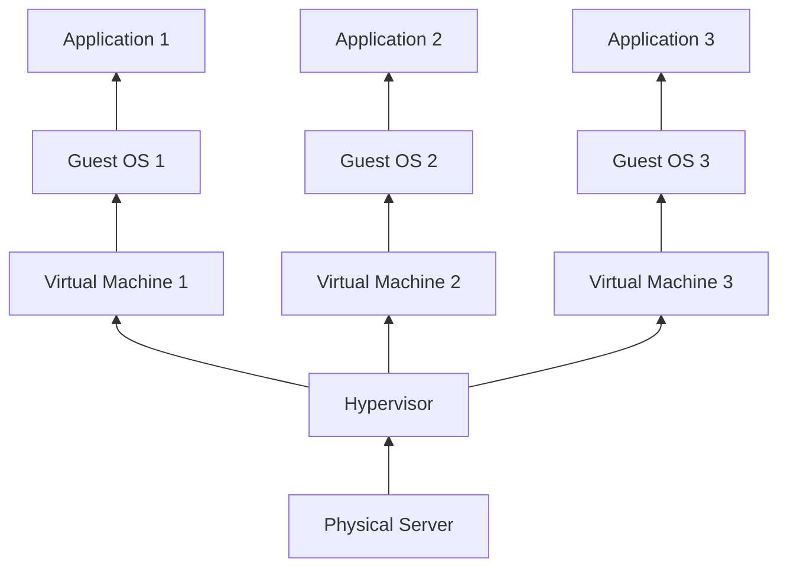
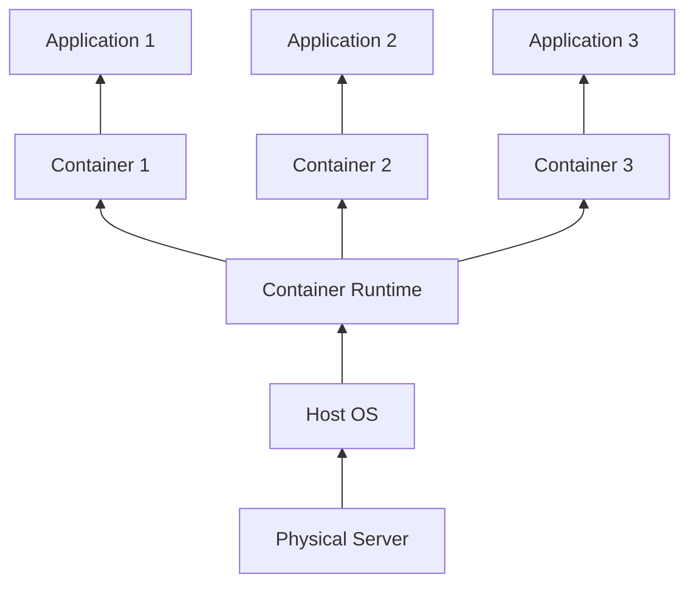
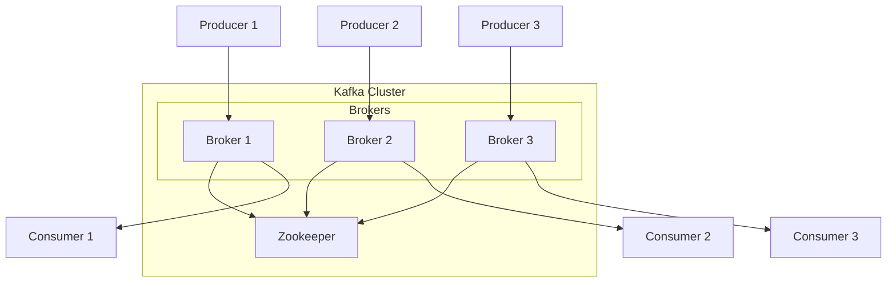
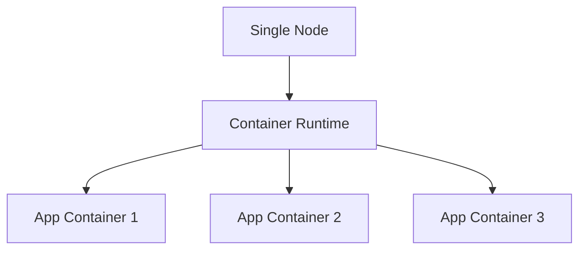
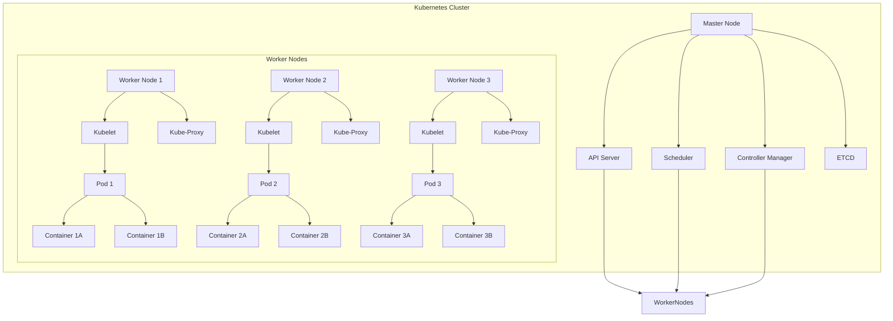

### Traditional Virtualization Architecture

### Containers Architecture

---------------

### Kafka Cluster with Multiple Brokers and a Single Zookeeper

----------------------

### Traditional Container Application on a Single Node

### Kubernetes Architecture

