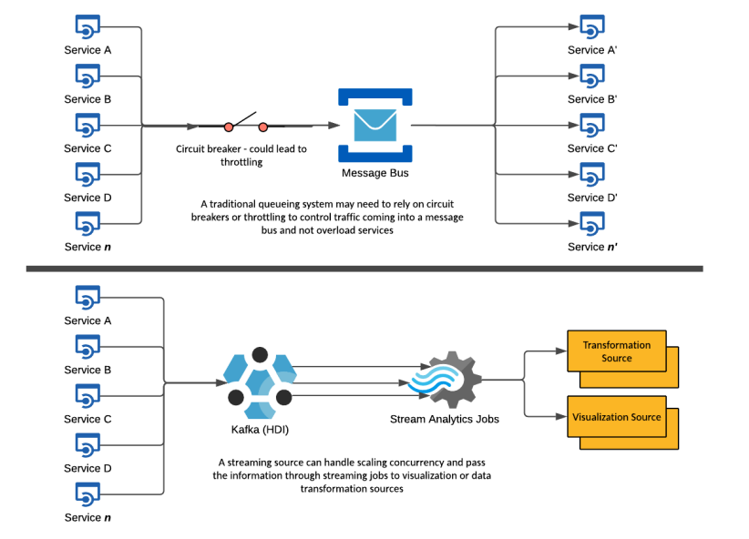
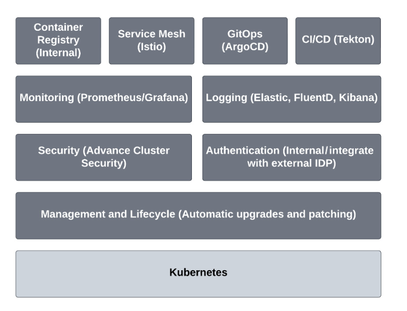
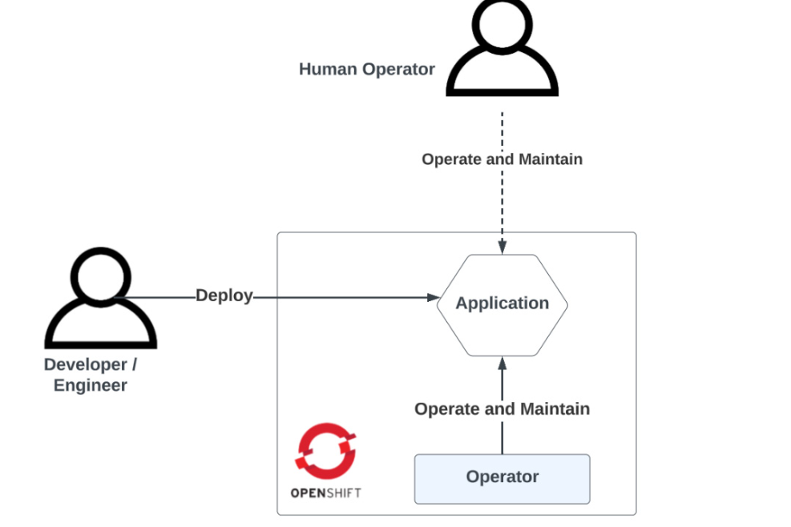

## Modern Data Processing and Management with OpenShift and Kafka


### Section 1: Traditional Message Bus vs. Kafka Streaming

#### Traditional Message Bus System


In traditional queuing systems, services communicate through a message bus, which often relies on circuit breakers to prevent overloading. This system can face issues with scalability and throttling as it handles incoming traffic.

- **Circuit Breakers**: These are used to prevent the system from being overwhelmed, but they can lead to throttling.
- **Message Bus**: Acts as an intermediary for communication between services.
- **Service Communication**: Services send and receive messages through the bus, which can become a bottleneck.

#### Kafka Streaming System


Kafka, a high-throughput distributed messaging system, improves scalability and concurrency management. It allows services to produce and consume data streams in real-time.

- **Kafka (HDI)**: Handles high-throughput data streams efficiently.
- **Stream Analytics Jobs**: Process data streams for transformation and visualization.
- **Scalability and Concurrency**: Kafka manages large volumes of data and concurrent processing without bottlenecks.

### Section 2: OpenShift Ecosystem



OpenShift provides a robust platform for deploying and managing containerized applications. It integrates various tools for CI/CD, monitoring, logging, and security.

- **Container Registry**: Manages internal container images.
- **Service Mesh (Istio)**: Manages microservice communication.
- **GitOps (ArgoCD)**: Implements continuous deployment.
- **CI/CD (Tekton)**: Automates the software development lifecycle.
- **Monitoring (Prometheus/Grafana)**: Tracks system performance.
- **Logging (Elastic, FluentD, Kibana)**: Centralizes log management.
- **Security (Advanced Cluster Security)**: Ensures robust security practices.
- **Authentication**: Manages user access and integrates with external identity providers.
- **Management and Lifecycle**: Handles automatic upgrades and patching.
- **Kubernetes**: Provides the underlying orchestration.

### Section 3: Developer and Operator Workflow in OpenShift



In OpenShift, the workflow involves developers deploying applications and operators maintaining and operating these applications.

- **Developer/Engineer**: Deploys the application.
- **Human Operator**: Operates and maintains the application.
- **OpenShift**: Facilitates deployment and operation through an operator, which automates operational tasks.


------------------------------------

### 1. Configure Kafka for KRaft Mode
Modify the `server.properties` file to configure Kafka in KRaft mode:

```bash
nano config/kraft/server.properties
```

Add or modify the following settings:

```properties
# Process roles
process.roles=controller,broker

# Node ID
node.id=1

# Controller Quorum Voters
controller.quorum.voters=1@localhost:9093

# Listeners for the controller
controller.listener.names=CONTROLLER

# Address for controller to listen on
listener.security.protocol.map=CONTROLLER:PLAINTEXT,PLAINTEXT:PLAINTEXT
listeners=PLAINTEXT://localhost:9092,CONTROLLER://localhost:9093
advertised.listeners=PLAINTEXT://localhost:9092

# Directory for metadata logs
log.dirs=/tmp/kraft-combined-logs

# Metadata log directories
metadata.log.dir=/tmp/kraft-metadata-logs

# Optional: specify the number of partitions and replication factor
num.partitions=1
default.replication.factor=1
```

#### 2. Format the Storage
Before starting Kafka in KRaft mode, you need to format the storage directories:

```bash
./bin/kafka-storage.sh format -t <uuid> -c config/kraft/server.properties
```

Replace `<uuid>` with a unique identifier. You can generate a UUID using the `uuidgen` command:

```bash
uuidgen
```

Example:

```bash
./bin/kafka-storage.sh format -t 8a6e95b0-f0c1-11eb-9a03-0242ac130003 -c config/kraft/server.properties
```

#### 3. Start Kafka in KRaft Mode
Start the Kafka server using the modified configuration file:

```bash
./bin/kafka-server-start.sh config/kraft/server.properties
```

#### 4. Verify the Setup
To verify that Kafka is running correctly in KRaft mode, you can use the Kafka command-line tools to create topics and produce/consume messages.

**Create a Topic**:

```bash
./bin/kafka-topics.sh --create --topic test-topic --bootstrap-server localhost:9092 --partitions 1 --replication-factor 1
```

**Produce Messages**:

```bash
./bin/kafka-console-producer.sh --topic test-topic --bootstrap-server localhost:9092
```

Type a few messages and press Enter.

**Consume Messages**:

```bash
./bin/kafka-console-consumer.sh --topic test-topic --from-beginning --bootstrap-server localhost:9092
```

